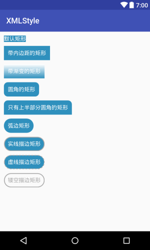

# Android 样式—— Shape篇


一个APP应保持统一的样式，比如控件间隔、文字大小和颜色，颜色搭配，Android额样式通过shape、sekector、layer-list、level-list、style、theme等组合实现。接下来，讲循序渐进的讲解这些样式的使用。首先我们讲解shape，定义基本的矩形、椭圆、直线、环等基础形状。

用shape定义的XML文件放在drawable目录下，使用shape标签可以自定义形状，以下是shape可以定义的四种类型的形状，通过属性android:shape 来指定：

+ rectangle: 矩形，默认属性，定义矩形；
+ oval: 椭圆形，画椭圆和圆
+ line: 直线
+ ring: 环形，可以画环形进度条；

## rectangle

rectangle是shape默认的形状，可以用来设置控件的背景，他的一些常用属性有：

+ solid：设置形状的填充颜色，只有一个属性
  + android:color 填充颜色
+ padding: 设置内容和形状便捷的内间距，有四个属性，分别设置上下左右的内间距:
  + android:left 左内间距
  + android:right 右内间距
  + android:top 上内间距
  + andorid:bottom 下内间距
+ gradient: 设置形状的渐变颜色
  + android:type 渐变的类型
    + linear 线性渐变,默认
    + radial 放射渐变同事需要设置android：gradientRadius 必须设置
    + sweep 扫描性渐变
  + android:startColor 渐变开始的颜色
  + android:endCOlor 渐变结束的颜色
  + android:centerColor 渐变中间的颜色
  + android:angle 渐变的角度，当为线性渐变时有效，默认为0，且必须为45的倍数，0表示从左往右，90表示从上往下。
  + android:centerX，渐变的中心X坐标，放射渐变有效，值为[0, 1],默认为0.5，表示正中间
  + android:centerY  渐变的中心Y坐标，放射渐变有效，值为[0, 1],默认为0.5，表示正中间
  + android:gradientRadius 渐变半斤，只有渐变类型是radial时有效
  + android:useLevel 如果为true，则可在LevelListDrawable中使用
+ corners: 设置圆角，只适合ractangle类型，但设置半径很大时，就变成弧边
  + android:radius 圆角半径
  + android:topLeftRadius 左上角的半径
  + android:topRIghtRadius 右上角半径
  + android:bottomLeftRadius 左下角半径
  + android:bottomRightRadius 右下角半径
+ stroke: 设置描边，可为实边或虚线
  + android:color 描边的颜色
  + android:width 描边的宽度
  + android:dashWidth 设置虚线的横线长度
  + android:dashGap 虚线时横线间的距离

以下是一个简单例子的:




实现代码在[项目](https://github.com/RanMaosong/Android-Style)的drawable目录下，依次为：

1. [shape_rectangle_default](https://github.com/RanMaosong/Android-Style/blob/master/app/src/main/res/drawable/shape_rectange_default.xml)
2. [shape_rectangle_with_padding](https://github.com/RanMaosong/Android-Style/blob/master/app/src/main/res/drawable/shape_rectange_with_padding.xml)
3. [shape_rectangle_with_gradient](https://github.com/RanMaosong/Android-Style/blob/master/app/src/main/res/drawable/shape_rectange_with_gradient.xml)
4. [shape_rectangle_with_corner](https://github.com/RanMaosong/Android-Style/blob/master/app/src/main/res/drawable/shape_rectange_with_corner.xml)
5. [shape_rectangle_with_topcorner](https://github.com/RanMaosong/Android-Style/blob/master/app/src/main/res/drawable/shape_rectange_with_topcorner.xml)
6. [shape_rectangle_with_arc](https://github.com/RanMaosong/Android-Style/blob/master/app/src/main/res/drawable/shape_rectange_with_arc.xml)
7. [shape_rectangle_with_stroke](https://github.com/RanMaosong/Android-Style/blob/master/app/src/main/res/drawable/shape_rectange_with_stroke.xml)
8. [shape_rectangle_with_stroke_dash](https://github.com/RanMaosong/Android-Style/blob/master/app/src/main/res/drawable/shape_rectange_with_stroke_dash.xml)
9. [shape_rectangle_with_stroke_only](https://github.com/RanMaosong/Android-Style/blob/master/app/src/main/res/drawable/shape_rectange_with_stroke_only.xml)

## oval

oval 用来花椭圆，通常用来画正圆，在上面的属性基础啊上加一个属性，用来设置形状的大小:

+ size: 设置形状的默认大小，可设置宽和高
  + android:width 宽度
  + android:height 高度


实现代码在[项目](https://github.com/RanMaosong/Android-Style)的drawable目录下，依次为：

1. [shape_oval_solid](https://github.com/RanMaosong/Android-Style/blob/master/app/src/main/res/drawable/shape_oval_solid.xml)
2. [shape_oval_padding](https://github.com/RanMaosong/Android-Style/blob/master/app/src/main/res/drawable/shape_oval_padding.xml)
3. [shape_oval_circle](https://github.com/RanMaosong/Android-Style/blob/master/app/src/main/res/drawable/shape_oval_circle.xml)
4. [shape_oval_stroke](https://github.com/RanMaosong/Android-Style/blob/master/app/src/main/res/drawable/shape_oval_stroke.xml)
5. [shape_oval_stroke_only](https://github.com/RanMaosong/Android-Style/blob/master/app/src/main/res/drawable/shape_oval_stroke_only.xml)
6. [shape_oval_dash_only](https://github.com/RanMaosong/Android-Style/blob/master/app/src/main/res/drawable/shape_oval_dash_only.xml)
7. [shape_oval_gradient](https://github.com/RanMaosong/Android-Style/blob/master/app/src/main/res/drawable/shape_oval_gradient.xml)

## line

line 用户花水平线，通过stroke和size特性组合来实线

```
<?xml version="1.0" encoding="utf-8"?>
<shape xmlns:android="http://schemas.android.com/apk/res/android"
    android:shape="line">
    <!-- 实际显示的线 -->
    <stroke
        android:width="1dp"
        android:color="#2F90BD"
        android:dashGap="2dp"
        android:dashWidth="4dp" />
    <!-- 形状的高度 -->
    <size android:height="4dp" />
</shape>
```


画线时，有几点特性必须要知道的：

1. 只能画水平线，画不了竖线；
2. 线的高度是通过stroke的android:width属性设置的；
3. size的android:height属性定义的是整个形状区域的高度；
4. size的height必须大于stroke的width，否则，线无法显示；
5. 线在整个形状区域中是居中显示的；
6. 线左右两边会留有空白间距，线越粗，空白越大；
7. 引用虚线的view需要添加属性android:layerType，值设为"software"，否则显示不了虚线。

## ring

ring形状特有的属性：

- *android:innerRadius* 内环的半径
- *android:innerRadiusRatio* 浮点型，以环的宽度比率来表示内环的半径，默认为3，表示内环半径为环的宽度除以3，该值会被android:innerRadius覆盖
- *android:thickness* 环的厚度
- *android:thicknessRatio* 浮点型，以环的宽度比率来表示环的厚度，默认为9，表示环的厚度为环的宽度除以9，该值会被android:thickness覆盖
- *android:useLevel* 一般为false，否则可能环形无法显示，只有作为LevelListDrawable使用时才设为true

效果图:


实现代码在[项目](https://github.com/RanMaosong/Android-Style)的drawable目录下，依次为：

1. [shape_ring_solid](https://github.com/RanMaosong/Android-Style/blob/master/app/src/main/res/drawable/shape_ring_solid.xml)
2. [shape_ring_gradient](https://github.com/RanMaosong/Android-Style/blob/master/app/src/main/res/drawable/shape_ring_gradient.xml)
3. [shape_ring_stroke_only](https://github.com/RanMaosong/Android-Style/blob/master/app/src/main/res/drawable/shape_ring_stroke_gradient.xml)
4. [shape_ring_stroke_gradient](https://github.com/RanMaosong/Android-Style/blob/master/app/src/main/res/drawable/shape_ring_stroke_only.xml)

至此，shape的基本用法已讲完，代码已放在github上：

github:[https://github.com/RanMaosong/Android-Style](https://github.com/RanMaosong/Android-Style)
